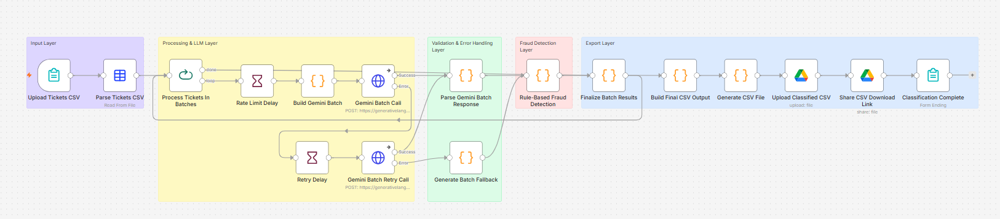

# AI Support Ticket Triage Agent

An AI-powered support ticket classification workflow built with **n8n Cloud** and **Google Gemini 2.5 Flash-Lite**.

The system automatically analyzes customer support tickets, classifies them, detects fraud-related signals, and generates a structured CSV output.

| Resource | Location |
|----------|----------|
| **Workflow export** | [`AI_ticket_triage_agent.json `](n8n/AI_ticket_triage_agent.json) |
| **Classification prompt** | [`classification_prompt.txt`](prompts/classification_prompt.txt) |

---

## How to Run the Project

You can try the workflow immediately or run your own copy:

### Live demo (recommended)

**[Open the ticket triage form](https://hadar.app.n8n.cloud/form/7ea19070-6c8d-47eb-b593-9cc91cc864dd)**

upload a tickets CSV and download the classified file when the run finishes. No n8n account, API key, or local setup needed.

### Import and run yourself

### Requirements

- [n8n Cloud](https://n8n.io/cloud/) account (or local n8n via Docker)
- [Gemini API key](https://aistudio.google.com/app/apikey)
- Google Drive connection *(optional, for cloud upload)*

### Setup Steps

#### 1. Import workflow

In n8n: **Menu (⋮) → Import from File** → select the submitted workflow file:

```
AI_ticket_triage_agent.json 
```

#### 2. Configure Gemini API credential

Create an **HTTP Header Auth** credential in n8n:

| Field | Value |
|-------|-------|
| Header name | `x-goog-api-key` |
| Header value | Your Gemini API key |

Link it to the **Gemini Batch Call** and **Gemini Batch Retry Call** nodes.

#### 3. Configure Google Drive credential *(optional)*

Connect Google Drive OAuth in n8n if you add upload/share nodes after CSV generation.

#### 4. Run the workflow

1. Activate the workflow and open the **Form Trigger** URL
2. Upload a CSV file with columns: `ticket_id`, `created_at`, `customer_name`, `customer_email`, `subject`, `body`, `status`
3. Wait for processing to complete
4. Download the generated CSV either from the download link (if Google Drive is configured) or directly from the **Generate CSV File** node output.

---

## What I Built

I built an end-to-end AI triage automation that:

- Accepts a CSV file containing support tickets
- Processes tickets in controlled batches
- Sends tickets to Gemini for classification
- Detects fraud indicators using both:
  - LLM reasoning
  - Additional rule-based fraud validation
- Handles malformed responses and API failures safely
- Generates a clean classified CSV file
- Returns a downloadable result from the workflow (Google Drive upload optional via n8n integration)

The workflow classifies every ticket into:

| Field | Output |
|-------|--------|
| `urgency` | High / Medium / Low |
| `category` | Document Issue / Account Access / Billing / Fraud Concern / General Inquiry |
| `summary` | One-sentence explanation |
| `flag_for_review` | Boolean fraud/security escalation flag |

---

## Architecture & Workflow Design

The workflow is divided into clear processing layers:

```

```

### 1. Input Layer

Receives a CSV upload through an n8n **Form Trigger** and parses the file into structured ticket objects.

**Main nodes:** `Upload Tickets CSV`, `Parse Tickets CSV`

### 2. Processing & LLM Layer

This layer validates input, filters invalid tickets, builds the Gemini prompt, and sends batch requests to the LLM.

**Design decisions:**
- Tickets are processed in **batches of 4**
- Rate-limiting delays are added between calls
- Retries are implemented automatically 
- Strict response schema enforcement is used via Gemini `responseSchema`

**Main nodes:** `Process Tickets In Batches`, `Build Gemini Batch`, `Gemini Batch Call`, `Retry Delay`, `Gemini Batch Retry Call`

### 3. Validation & Error Handling Layer

The workflow **never trusts the LLM blindly**. It validates:
- JSON structure
- Required fields
- Valid enum values
- Missing tickets in batch responses
- Malformed responses
- Timeout and API failures

If anything fails, the workflow generates a **safe fallback classification** instead of crashing.

**Main nodes:** `Parse Gemini Batch Response`, `Generate Batch Fallback`

### 4. Fraud Detection Layer

The system does not rely only on the LLM. After Gemini returns a classification, an additional local fraud-detection engine runs using regex-based security rules.

This catches signals such as:
- Forged documents
- Identity theft
- Impersonation
- Unauthorized account usage
- Suspicious verification bypass attempts

If fraud indicators are detected:
- `category` → **Fraud Concern**
- `urgency` → **High**
- `flag_for_review` → **true**

This hybrid approach improves reliability and reduces dependence on probabilistic AI outputs.

**Main node:** `Rule-Based Fraud Detection`

### 5. Export Layer

Finally, results are normalized, internal metadata is removed, a secure CSV file is generated, the file is uploaded to Google Drive, and a public download link is returned

**Main nodes:** `Finalize Batch Results`, `Build Final CSV Output`, `Generate CSV File`, `Upload Classified CSV`, `Share CSV Download Link`

---

## Why I Chose n8n Cloud

I chose n8n Cloud because it allowed me to build and iterate quickly while focusing on workflow logic instead of infrastructure setup.

**Advantages:**
- Fast visual development
- Built-in retry and error handling
- Native integrations (HTTP, Google Drive, Forms)
- Easy batching and orchestration
- Cloud-hosted execution
- No local deployment required for reviewers
- Easy export/import of workflows

For this assignment, n8n provided the fastest path to building a production-style AI automation system within the limited time scope.

---

## Prompt Engineering Approach

A good prompt is **specific**, **constrained**, **deterministic**, **structured**, resistant to hallucinations, and optimized for token efficiency.

Instead of a vague instruction like *"Classify this ticket"*, I designed a structured prompt that:
- Defines exact categories and category boundaries
- Defines urgency rules
- Defines fraud escalation rules
- Enforces JSON-only output (no markdown wrappers)
- Restricts the model to the required four fields

The workflow also uses Gemini **`responseSchema`** to force predictable structured data, which improves:
- Consistency
- Parsing reliability
- Token efficiency
- Output validation
- Error recovery

---

## Edge Cases & Failure Handling

Handling the unhappy path was a core focus of this project.

### Empty Tickets

Empty or unreadable tickets are **never sent to Gemini**.
This prevents:
- wasted API calls
- unnecessary token usage
- invalid classifications

Instead, the workflow safely skips them and generates a controlled fallback result.

### Gemini Rate Limits (429 Errors)

To handle free-tier rate limits:
- Tickets are processed in small batches
- Delays are added between requests
- Automatic retry logic with exponential backoff is implemented
- Safe fallback responses are generated if retries fail

### Malformed LLM Output

LLMs sometimes return invalid JSON, partial JSON, markdown wrappers, or missing fields. The workflow:
- Extracts JSON safely
- Validates structure and enum values
- Validates required fields
- Falls back safely if parsing fails

### Missing Ticket Results

If Gemini returns classifications for only some tickets in a batch, the workflow detects missing entries, generates fallback classifications for missing items only, and continues execution.

### API Timeouts / Model Failures

Handled explicitly via retry routing: timeout detection, unavailable model detection, and generic API failure handling. 
The workflow always completes gracefully instead of crashing.

### CSV Injection Protection

The final CSV export sanitizes values that start with `=`, `+`, `-`, or `@` to prevent spreadsheet formula-injection attacks when the file is opened in Excel or similar tools.

---

## Security Considerations

### API Keys

API keys are **never hardcoded** in the workflow. Gemini credentials are stored in **n8n Credentials** (HTTP Header Auth: `x-goog-api-key`). Exported workflow JSON does not contain secrets.

### Controlled LLM Communication

Only minimum required ticket fields are sent to the LLM (`subject`, `body`, and basic metadata). No system credentials are transmitted.

### Output Validation

All LLM responses are validated before being trusted, preventing malformed outputs, schema drift, unexpected field injection, and invalid classifications.

### Retry Isolation

Retries are isolated and capped to avoid infinite loops, uncontrolled token consumption, and API abuse.

---

## Technologies Used

- n8n Cloud
- Google Gemini 2.5 Flash-Lite
- JavaScript (n8n Code nodes)
- Google Drive API *(optional)*
- CSV processing

---

## Key Design Philosophy

> **"Never trust the LLM blindly."**

The workflow treats the LLM as one intelligent component inside a larger reliable system. That is why the solution includes:
- Schema enforcement
- Fallback generation
- Retry handling
- Fraud verification rules
- Response validation
- Token optimization
- Security protections
- Deterministic output normalization

The goal was not only to make the workflow work, but to make it **resilient**, **explainable**, and **safe under failure conditions**.